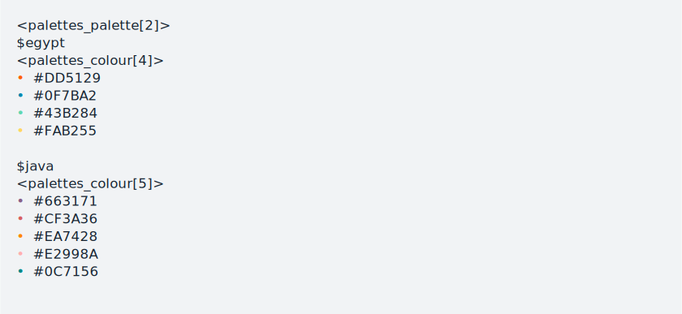

<!-- README.md is generated from README.Rmd. Please edit that file -->

# palettes <a href='https://mccarthy-m-g.github.io/palettes/'></a>

<!-- badges: start -->

[](https://github.com/mccarthy-m-g/palettes/actions/workflows/R-CMD-check.yaml)
[](https://app.codecov.io/gh/mccarthy-m-g/palettes?branch=main)
[](https://CRAN.R-project.org/package=palettes)
[](https://cran.r-project.org/package=palettes)
<!-- badges: end -->

palettes is an R package for working with colour vectors and colour
palettes. There are three main goals to the palettes package, each
described in a vignette:

-   To provide a new family of colour classes (`palettes_colour` and
    `palettes_palette`) that always print as hex codes with colour
    previews; `vignette("palettes")`.

-   To provide a comprehensive library of methods for working with
    colour vectors and colour palettes, including methods for ggplot2,
    `vignette("ggplot2")`; gt, `vignette("gt")`; biscale,
    `vignette("biscale")`; and other colour packages,
    `vignette("compatibility")`.

-   To make it easy for anyone to make their own colour palette package;
    `vignette("creating-packages")`. Colour palette packages made with
    palettes exist solely for the purpose of distributing colour
    palettes and get access to all the features of palettes for free.

## Installation

Install palettes from
[CRAN](https://CRAN.R-project.org/package=palettes) with:

``` r
install.packages("palettes")
```

Install the development version from
[GitHub](https://github.com/mccarthy-m-g/palettes) or
[R-universe](https://mccarthy-m-g.r-universe.dev/palettes) with:

``` r
# Install from GitHub
# install.packages("remotes")
remotes::install_github("mccarthy-m-g/palettes")

# Install from R-universe
install.packages("palettes", repos = "https://mccarthy-m-g.r-universe.dev")
```

Install the [WebAssembly](https://webassembly.org) version for use in
[WebR](https://docs.r-wasm.org/webr/latest/) applications with:

``` r
# Install CRAN version from r-wasm
install.packages("palettes", repos = "https://repo.r-wasm.org")

# Install development version from R-universe
install.packages(
  "palettes",
  repos = c("https://mccarthy-m-g.r-universe.dev", "https://repo.r-wasm.org")
)
```

## Usage

``` r
library(palettes)
```

Colours can be specified by name (as listed by `grDevices::colours()`):

``` r
pal_colour("red")
```


Or by hex code:

``` r
pal_colour("#FF0000")
```


Multiple colours can be specified at once as a character vector:

``` r
pal_colour(c("#a00e00", "#d04e00", "#f6c200", "#0086a8", "#132b69"))
```


Named colour palettes can be specified in the same way:

``` r
pal_palette(
  egypt = c("#dd5129", "#0f7ba2", "#43b284", "#fab255"),
  java  = c("#663171", "#cf3a36", "#ea7428", "#e2998a", "#0c7156")
)
```



Colours also print nicely in tibbles:

``` r
as_tibble(pal_colour(c("#dd5129", "#0f7ba2", "#43b284", "#fab255")))
```


## Documentation

See at
[`https://mccarthy-m-g.github.io/palettes/`](https://mccarthy-m-g.github.io/palettes/reference/index.html)
and also in the installed package: `help(package = "palettes")`.

## License

MIT © Michael McCarthy
